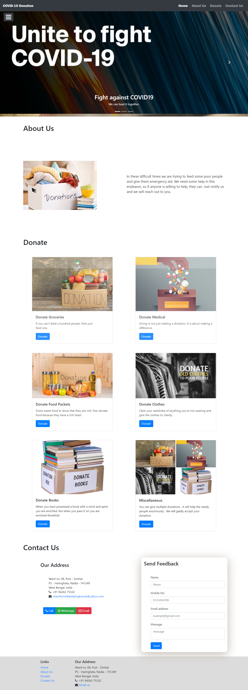

## COVID-19 Donation Server

## [Click Me](https://helping-hand-covid19.herokuapp.com/) 
<span><p>(Note: The database is temporarily down, the server is no longer accepting donations. For further info contact us via Email Id given below)</p></span>
<br>

[![Contributors][contributors-shield]][contributors-url]
[![Forks][forks-shield]][forks-url]
[![Stargazers][stars-shield]][stars-url]
[![Issues][issues-shield]][issues-url]

<!-- PROJECT LOGO -->
<br />
<p align="center">
  <a href="https://github.com/MayukhC99/Covid-19_Donation_Server">
    
  </a>

  <h3 align="center">Covid-19_Donation_Server</h3>

  <p align="center">
    Unite to fight Covid-19!
    <br />
    <a href="https://github.com/MayukhC99/Covid-19_Donation_Server"><strong>Explore the docs »</strong></a>
    <br />
    <br />
    <a href="https://github.com/MayukhC99/Covid-19_Donation_Server">View Demo</a>
    ·
    <a href="https://github.com/MayukhC99/Covid-19_Donation_Server/issues">Report Bug</a>
    ·
    <a href="https://github.com/MayukhC99/Covid-19_Donation_Server/issues">Request Feature</a>
  </p>
</p>


<!-- TABLE OF CONTENTS -->
## Table of Contents

* [About the Project](#about-the-project)
  * [Built With](#built-with)
* [Getting Started](#getting-started)
  * [Prerequisites](#prerequisites)
  * [Installation](#installation)
* [Roadmap](#roadmap)
* [Contributing](#contributing)
* [License](#license)
* [Contact](#contact)
* [Acknowledgements](#acknowledgements)


<!-- ABOUT THE PROJECT -->
## About The Project

In these difficult times we are trying to feed some poor people and give them emergency aid. We need help in this endeavor, so if anyone is willing to help, they can. You can now make your donation reach to the needy peoples through us. This Website provides a way for you to donate. You can create and manage your account, track your donation, and get endorsed for each donation you make.

Major facilities:
* Donate food, emergency aid to the needy peoples.
* Managing your account and track your donations.

### Built With
Some major frameworks/library used in this project:-
* [Bootstrap](https://getbootstrap.com)
* [JQuery](https://jquery.com)
* [NodeJs](https://nodejs.org)
* [ExpressJs](https://expressjs.com/)
* [MySql2](https://www.npmjs.com/package/mysql2)
* [Passport](http://www.passportjs.org/)
* [Sequelize](https://sequelize.org/)


<!-- GETTING STARTED -->
## Getting Started

To get a local copy up and running follow these simple example steps.

### Prerequisites

This is an example of how to list things you need to use the software and how to install them.
* npm
```sh
npm install npm@latest -g
```

### Installation

1. Clone the repo
```sh
git clone https://github.com/MayukhC99/Covid-19_Donation_Server
```
2. Install NPM packages
```sh
npm install
```


<!-- USAGE EXAMPLES -->


<!-- ROADMAP -->
## Roadmap

See the [open issues](https://github.com/MayukhC99/Covid-19_Donation_Server/issues) for a list of proposed features (and known issues).


<!-- CONTRIBUTING -->
## Contributing

Contributions are what make the open source community such an amazing place to be learn, inspire, and create. Any contributions you make are **greatly appreciated**.

1. Fork the Project
2. Create your Feature Branch (`git checkout -b feature/AmazingFeature`)
3. Commit your Changes (`git commit -m 'Add some AmazingFeature'`)
4. Push to the Branch (`git push origin feature/AmazingFeature`)
5. Open a Pull Request


<!-- LICENSE -->
## License

Distributed under the MIT License. See `LICENSE` for more information.


<!-- CONTACT -->
## Contact

Name - [Covid-19_Donation_Server](shareforindiahelpinghands@yahoo.com) - shareforindiahelpinghands@yahoo.com

Project Link: [https://github.com/MayukhC99/Covid-19_Donation_Server](https://github.com/MayukhC99/Covid-19_Donation_Server)


<!-- ACKNOWLEDGEMENTS -->
## Acknowledgements
* [GitHub Pages](https://pages.github.com)
* [Slick Carousel](https://kenwheeler.github.io/slick)
* [Smooth Scroll](https://github.com/cferdinandi/smooth-scroll)
* [Sticky Kit](http://leafo.net/sticky-kit)
* [JVectorMap](http://jvectormap.com)
* [Font Awesome](https://fontawesome.com)


<!-- MARKDOWN LINKS & IMAGES -->
<!-- https://www.markdownguide.org/basic-syntax/#reference-style-links -->
[contributors-shield]: https://img.shields.io/github/contributors/MayukhC99/Covid-19_Donation_Server
[contributors-url]: https://github.com/MayukhC99/Covid-19_Donation_Server/graphs/contributors
[forks-shield]: https://img.shields.io/github/forks/MayukhC99/Covid-19_Donation_Server
[forks-url]: https://github.com/MayukhC99/Covid-19_Donation_Server/network/members
[stars-shield]: https://img.shields.io/github/stars/MayukhC99/Covid-19_Donation_Server
[stars-url]: https://github.com/MayukhC99/Covid-19_Donation_Server/stargazers
[issues-shield]: https://img.shields.io/github/issues/MayukhC99/Covid-19_Donation_Server
[issues-url]: https://github.com/MayukhC99/Covid-19_Donation_Server/issues
[license-shield]: https://img.shields.io/github/license/othneildrew/Best-README-Template.svg?style=flat-square
[license-url]: https://github.com/othneildrew/Best-README-Template/blob/master/LICENSE.txt
[linkedin-shield]: https://img.shields.io/badge/-LinkedIn-black.svg?style=flat-square&logo=linkedin&colorB=555
[linkedin-url]: https://linkedin.com/in/othneildrew
[product-screenshot]: images/screenshot.png

#### Note: The database is temporarily down. The server is no longer accepting donations.
